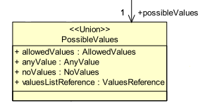
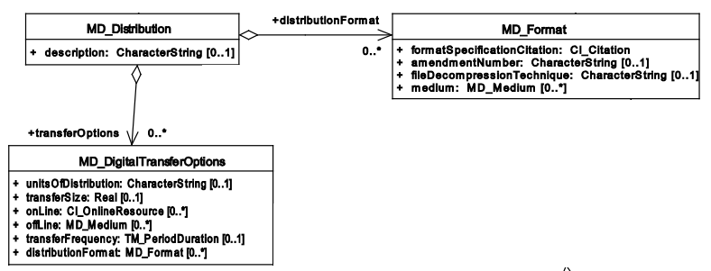
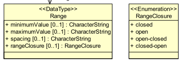
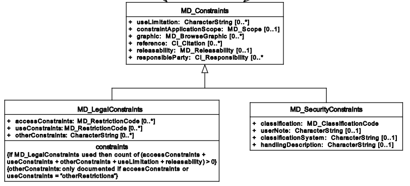

[[Clause_Rules_Schemas]]
== Rules for encoding JSON Schema conforming to UML class diagrams

//-------Remove after TC approval-------

Readers should consider the following warning.

WARNING: This document defines a draft OGC Best Practice on a particular technology or approach. This document is not an OGC Standard and may not be referred to as an OGC Standard. This document is not an official position of the OGC.

//----------------------------------------

The rules provided in this clause and in the following one <<Clause_Rules_Instances>> have been created in a very formal way using normative language (i.e. using SHALL as a indication of obligation). Even if this style could be considered not appropriate for an ER, it has been done with the objective of facilitating the migration of the rules into normative document or an standard in the near future. In this sense, they are numbered and contain only ONE normative paragraph after the rule number. The normative text has been elaborated with the intention of being self-sufficient to implement an _encoding service_. However, the consequences or the reasoning behind a rule are sometimes difficult to extract from the rule itself. In these cases, after the normative text, informative (non-normative) justifications, clarifications and examples can follow.

This chapter focuses on _JSON Schemas_. Rules have been classified in subsections for clarification purposes only. All rules form a single corpus and need to be applied together. In practice, these rules inform UML application schema conversion implementors such as, for example, ShapeChange.

include::requirements/requirements_class_01.adoc[]

=== Root element

include::requirements/REQ001.adoc[]

[source,JSON]
.Example of the start of a JSON Schema file that defines the root property as an object.
----
{
	"$schema": "http://json-schema.org/draft-04/schema#",
	"title": "Coverage objects",
	"description": "Schema for Coverage objects",
	"type": "object"
}
----

=== Namespaces

TBA

=== Objects

include::requirements/REQ002.adoc[]

[source,JSON]
.Example of the addition of the necessary id's
----
{
	[...]
	"type": "object",
	"required": [ "id", ... ],
	"properties": {
		"id": { "type": "string", "format": "uri"},
		[...]
	},
}
----

include::requirements/REQ003.adoc[]

[source,JSON]
.Example of the addition of the necessary type's
----
{
	"seviceIdentification": {
		"title": "Sevice identification",
        "type": "object",
		"required": [ "id", "type", ... ],
		"properties": {
			"type": { "enum": ["SeviceIdentification"] },

}
----

[[requirement4,Requirement 4]]
include::requirements/REQ004.adoc[]

[[r_sch_image_possible_values]]
.UML model for a generalized class ServiceIdentification.

[source,JSON]
.JSON Schema fragment example of a UML Union encoded in JSON.
----
"possibleValues": {
	"title": "Possible Values list",
	"type": "object",
	"anyOf": [
		{
			"required": [ "type", "allowedValues"],
			"properties": {
				"type": { "enum": ["PossibleValues"] },
				"allowedValues": { "$ref": "#/definitions/AllowedValues" }
			}
		},{
			"required": [ "type", "anyValue"],
			"properties": {
				"type": { "enum": ["PossibleValues"] },
				"anyValue": { "$ref": "#/definitions/AnyValue" }
			}
		},{
			"required": [ "type", "noValues"],
			"properties": {
				"type": { "enum": ["PossibleValues"] },
				"noValues": { "$ref": "#/definitions/NoValues" }
			}
		},{
			"required": [ "type", "valuesListReference"],
			"properties": {
				"type": { "enum": ["PossibleValues"] },
				"valuesListReference": { "$ref": "#/definitions/ValuesReference" }
			}
		}
	]
}
----

include::requirements/REQ005.adoc[]

[[r_sch_image_md_format]]
.UML model showing a class that is defined as an aggregation of MD_Distribution and also as a complex data type MD_DigitalTransferOptinos

[source,JSON]
.JSON Schema fragment example of a class used as an aggregation and as a data type (the example ignores the transferOption multiplicity for simplicity)
----
{
    ...
    "distributionInfo": {
        "description": {"type": "string"},
        "distributionFormat": {"$ref": "#/definitions/MD_format"},
        "transferOptions": {
            ...
            "distributionFormat": {"$ref": "#/definitions/MD_format"}
        }
    }
}
----

Please consider the rules for complex attributes and properties below.

=== Object attributes; names

include::requirements/REQ006.adoc[]

[source,JSON]
.Example of axisLabel, lowerBound and upperBound properties definition.
----
{
	"type": "object",
	"properties": {
		"type": { "enum": [ "IndexAxisType"] },
        "axisLabel":  { "type": "string" },
		"lowerBound":  { "type": "number" },
		"upperBound": { "type": "number" }
	},
----

=== Object attributes; multiplicity

include::requirements/REQ007.adoc[]

[source,JSON]
.Example of axisLabel, lowerBound and upperBound properties definition.
----
	"axis": {
		"type": "object",
		"properties": {
			"type": { "enum": [ "IndexAxisType"] },
			"axisLabel":  { "type": "string" },
			"lowerBound":  { "type": "number" },
			"upperBound": { "type": "number" }
		}
	},
----

include::requirements/REQ008.adoc[]

[source,JSON]
.Example of the "required" list of property.
----
	"axis": {
		"type": "object",
		"required": [ "type", "axisLabel", "lowerBound", "upperBound" ],
		"properties": {
			"type": { "enum": [ "IndexAxisType"] },
			"axisLabel":  { "type": "string" },
			"lowerBound":  { "type": "number" },
			"upperBound": { "type": "number" }
		}
	},
----

include::requirements/REQ009.adoc[]

In JSON instances the arrays of JSON objects will defined the type for each member of the array. The "type" can be different from the other members of the array (JavaScript allows arrays that are heterogenous in types) but all "type" values will be an generalization of the same generic UML class.

[source,JSON]
.Example of JSON schema for numeric properties with multiplicity more than 1.
----
{
	"coordinates": {
		"type": "array",
		"items": { "type": "number" }
	},
}
----

=== Object attributes; data types

include::requirements/REQ010.adoc[]

[source,JSON]
.Example of JSON schema for anyURL properties with multiplicity 0 or 1.
----
{
	"lowerBound":  { "type": "number" },
	"upperBound": { "type": "number" }
}
----

In JSON there is no distinction between different numeric data types: E.g. Integer, Float, Double etc and they all became _number_.

Numeric attributes with multiplicity more than 1 will have "type": "array" and "items": {"type": "number"} in the JSON Schema.

[source,JSON]
.Example of JSON schema for numeric properties with multiplicity more than 1.
----
{
	"coordinates": {
		"type": "array",
		"items": { "type": "number" }
	},
}
----

include::requirements/REQ011.adoc[]

Boolean attributes with multiplicity more than 1 will have "type": "array" and "items": {"type": "boolean"} in the JSON Schema.

include::requirements/REQ012.adoc[]

[source,JSON]
.Example of JSON schema for anyURL properties with multiplicity 0 or 1.
----
{
	"axisLabel":  { "type": "string" }
}
----

If there is a reason to believe that the attribute has been defined as UML string to allow both numbers or strings (depending of the case), define the type as an array of "number" and "string" is recommended.

[source,JSON]
.Example of JSON schema for an string that can be also instantiated as a number.
----
{
	"value":  { "type": ["number", "string"] },
}
----

String attributes with multiplicity more than 1 will have "type": "array" and "items": {"type": "string"} in the JSON Schema.

[source,JSON]
.Example of JSON schema for string properties with multiplicity more than 1.
----
{
	"axisLabels":
	{
		"type": "array",
		"items": { "type": "string" }
	}
}
----

include::requirements/REQ013.adoc[]

[source,JSON]
.Example of JSON schema for anyURL properties with multiplicity 0 or 1.
----
{
    "srsName": { "type": "string", "format": "uri"}
}
----

anyURL attributes with multiplicity more that 1 will have "type": "array" and "items": {"type": "string", "format": "uri"} in the JSON Schema.

[source,JSON]
.Example of JSON schema for anyURL properties with multiplicity more than 1.
----
{
	"srsNames":
	{
		"type": "array",
		"items": { "type": "string", "format": "uri"}
	}
}
----

include::requirements/REQ014.adoc[]

[source,JSON]
.Example of JSON schema for complex properties with multiplicity 0 or 1.
----
{
	"generalGrid":{
		"title": "General Grid",
		"description": "General Grid",
		"type": "object"
	}
}
----

Complex type attributes with multiplicity more than 1 will have "type": "array" and "items": {"type": "object"} in the JSON Schema

[source,JSON]
.Example of JSON schema for complex properties with multiplicity more than 1.
----
{
	"axis": {
		"type": "array",
		"items": {
			"type": "object"
		}
	}
}
----

=== Object attributes; null values

include::requirements/REQ015.adoc[]

[source,JSON]
.Example of a nullable value.
----
{
	"lowerBound":  { "type": ["number", "null"] },
}
----

=== Object attributes; enumerations and code-lists

include::requirements/REQ016.adoc[]

[[r_sch_image_range_closure]]
.UML model for an enumeration.

[source,JSON]
.Example of enumerations
----
{
	"$schema": "http://json-schema.org/draft-04/schema#",
	"type": "object",
	"properties": {
		"rangeClosure": {"$ref": "#/definitions/RangeClosure"},
		...
	}
	"definitions": {
		"RangeClosure": {
			"title": "Values of RangeClosure enumeration",
			"enum": ["closed", "open", "open-closed", "closed-open"]
		}
	}
}
----

include::requirements/REQ017.adoc[]

[source,JSON]
.Example of the addition of the necessary id's
----
{
	"$schema": "http://json-schema.org/draft-04/schema#",
	"type": "object",
	"required": [ "codelist_a"],
	"properties": {
		"codelist_a": { "$ref": "#/definitions/codelist1" },
		...
	},
	"definitions": {
		"codelist": {
			"oneOf": [
				{
					"enum": [ "a2", "b2", "c2" ]
				},{
					"type": "string"
				}
			]
		}
	}
}
----

The reason for this is that codelist are considered extendable and in practice they should support any value. See a good discussion on how to encode  enumeration an codelist in JSON Schema here: http://grokbase.com/t/gg/json-schema/14b79eqgqq/code-list-enum-extension

=== Objects: Data types and inheritance

include::requirements/REQ018.adoc[]

Actually, it is highly recommended that all UML classes are defined in the _definitions_ sections. Only the objects defined in the _definitions_ and the root object can be referenced from another JSON schema.

[source,JSON]
.JSON Schema fragment example of the use of definitions section.
----
{
	"$schema": "http://json-schema.org/draft-04/schema#",
    "type": "object",
	"properties": {
		"seviceIdentification": { "$ref": "#/definitions/SeviceIdentification" },
		...
	},
	"definitions": {
		"ServiceIdentification": {
			"title": "Service identification",
            "type": "object",
			"required": [ "type", "serviceType", "serviceTypeVersion" ],
        	"properties": {
				"type": { "enum": ["ServiceIdentification"] },
				"serviceType": { "$ref": "#/definitions/Code"},
				"serviceTypeVersion":  {
					"type": "array",
					"items": {"type": "string" }
				},
				"profile":  {
					"type": "array",
					"items": {"type": "string"}
				},
				"fees": {"type": "string"},
				"accessConstraints": {"type": "string"}
			}
		}
    }
}

----

[source,JSON]
.Example of using "definitions" section to define an object that can be used in more that one place emulating the UML data type behavior.
----
{
{
	"$schema": "http://json-schema.org/draft-04/schema#",
	"type": "object",
	"properties": {
		"profile" : { "$ref": "#/definitions/links" },
		"links" : {
			"type": "array",
			"items": { "$ref": "#/definitions/links" }
		}
	}
    "definitions": {
    	"links": {
		    "title": "links",
		    "description": "Properties that all types of links have. It mimics the Atom link",
		    "required": [ "href" ],
		    "properties": {
			"href": {"type": "string", "format": "uri" },
			"type" : { "type": "string" },
			"title" : { "type": "string" },
			"lang" : { "type": "string" }
		    }
		}
	}
----

include::requirements/REQ019.adoc[]

Unnecessary duplication of the definition do the common elements coming from the abstract class is avoided by using _$ref_ and pointing to a _definitions_ element in the JSON Schema. There is no mechanism to inhered properties from a previous object in JSON schema but the suggested mechanism achieves an equivalent results.

[[r_sch_image_service_identification]]
.UML model for a generalized class ServiceIdentification.
image::images/ServiceIdentification.png[]

[source,JSON]
.JSON Schema fragment example of generalization of ServiceIdentification inheriting a group of properties DescriptionProperties. Note that "Description" is defined for completeness but it is not used.
----
{
	"$schema": "http://json-schema.org/draft-04/schema#",
	"type": "object",
	"properties": {
		"serviceIdentification": { "$ref": "#/definitions/ServiceIdentification" }
	},
	"definitions": {
		"ServiceIdentification": {
			"required": ["type"],
			"allOf": [
				{ "$ref": "#/definitions/DescriptionProperties" },
				{
					"properties":{
						"type": {"enum": ["ServiceIdentification"]},
						"serviceTypeVersion": {"type": "string"},
						"profile": {"type": "string"},
						"fees": {"type": "string"},
						"accessConstraints": {"type": "string"}
					}
				}
			]
		},
		"Description": {
			"required": ["type"],
			"allOf": [
				{ "$ref": "#/definitions/DescriptionProperties" },
				{
					"properties":{
						"type": {"enum": ["Description"]}
					}
				}
			]
		},
		"DescriptionProperties": {
			"properties": {
				"id": {"type": "string", "format": "uri"},
				"title": {"type": "string"},
				"abstract": {"type": "string"}
			}
		}
	}
}
----

[source,JSON]
.JSON fragment that validates with he previous example
----
{
	"serviceIdentification": {
		"type": "ServiceIdentification",
		"title": "My WMS server",
		"abstract": "This WMS server is mine",
		"serviceTypeVersion": "1.1.1",
		"profile": "http://www.opengis.net/profiles/nga"
	}
}
----

include::requirements/REQ020.adoc[]

In the following example, the class MD_Constraints is generalized into 2 different classes: MD_LegalConstraints and MD_SecurityConstraints. The pattern used in the example is a bit different for the one in the example of <<requirement4>>. Testing the us of _oneOf_ to select between object definitions that contains _allOf_ including the same $ref fails to work. To solve this, we define _MD_LegalConstraintsAdditions_ and _MD_SecurityConstraintsAdditions_ that only defines the non common properties. Then A new object _Alternatives_MD_Constraints_ offers all the alternatives available with _oneOf_  and add the common properties _MD_ConstraintsProperties_ at the end with _allOf_.

[[r_sch_image_constraints]]
.UML model for a generalized class from MD_Constraints.

[source,JSON]
.Example of multiple generalization
----
{
	"$schema": "http://json-schema.org/draft-04/schema#",
	"type": "object",
	"properties":
	{
		"resourceConstraints": {
			"$ref": "#/definitions/Alterantives_MD_Constraints"
		}
	},
	"definitions": {
		"Alterantives_MD_Constraints": {
			"type": "object",
			"allOf": [
				{ "$ref": "#/definitions/MD_ConstraintsProperties" },
				{ "oneOf": [
						{"$ref": "#/definitions/MD_SecurityConstraintsAdditions"},
						{"$ref": "#/definitions/MD_LegalConstraintsAdditions"},
						{"$ref": "#/definitions/MD_ConstraintsAdditions"}
					]
				}
			]
		},
		"MD_LegalConstraintsAdditions": {
			"required": ["type"],
			"properties":{
				"type": {"enum": ["MD_LegalConstraints"]},
				"accessConstraints": {"type": "object"},
				"otherConstraints": {"type": "string"}
			}
		},
		"MD_SecurityConstraintsAdditions": {
			"required": ["type"],
			"properties":{
				"type": {"enum": ["MD_SecurityConstraints"]},
				"useNote": {"type": "string"},
				"classificationSystem": {"type": "string"},
				"handlingDescription": {"type": "string"}
			}
		},
		"MD_ConstraintsAdditions": {
			"required": ["type"],
			"properties":{
				"type": {"enum": ["MD_Constraints"]}
			}
		},
		"MD_ConstraintsProperties": {
			"properties": {
				"id": {"type": "string", "format": "uri"},
				"useLimitation": {"type": "string"},
				"constraintApplicationScope": {"type": "object"}
			}
		}
	}
}
----

=== Object libraries and multiple schemas

UML classes can be structured in a modular way in packages. In this case there is a need to use more than one schema file. The core schema offers a set of _datatypes_ in the _definitions_ section. This core schemas can be reused by other schemas pointing the definition of the right objects in the core schemas using a full path to them.

include::requirements/REQ021.adoc[]

[source,JSON]
.Example of a core JSON schema (called ServiceMetadata_schema.json) for a common class in OWS common package
----
{
	"$schema": "http://json-schema.org/draft-04/schema#",
	"definitions": {
		"ServiceIdentification": {
			"title": "Service identification",
			"description": "Metadata about this specific server. The contents and organization of this section should be the same for all OWSs. ",
			"type": "object",
			"properties": {
				"type": { "enum": ["ServiceIdentification"] },
				"serviceType": { "$ref": "#/definitions/Code"},
				"serviceTypeVersion":  {
					"type": "array",
					"items": {"type": "string" }
				},
				"profile":  {
					"type": "array",
					"items": {"type": "string"}
				},
				"fees": {"type": "string"},
				"accessConstraints": {"type": "string"}
			}
		}
	}
}
----

[source,JSON]
.Example of a another JSON schema (called WMSServiceMetadata_schema.json) for a common class in OWS common package
----
{
	"$schema": "http://json-schema.org/draft-04/schema#",
	"title": "WMS Service Metadata root object",
    "required": [ "type", "version"],
	"properties": {
		"type": { "enum": [ "WMSServiceMetadata"] },
		"id":  { "type": "string" },
		"version": { "type": "string"},
		"serviceIdentification": { "$ref": "ServiceMetadata_schema.json/#/definitions/ServiceIdentification" },
	}
}
----

[source,JSON]
.Example of a JSON instance (called WMSServiceMetadata.json) validated with the WMSServiceMetadata_schema.json file.
----
{
 	"type": "WMSServiceMetadata",
	"version": "1.4",
	"serviceIdentification": {
		"type": "ServiceIdentification",
		"serviceType": {
			"type": "Code",
			"code": "WMS"
		},
		"serviceTypeVersion": ["1.4"],
        ...
	}
}
----
