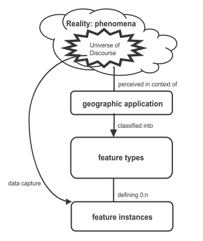
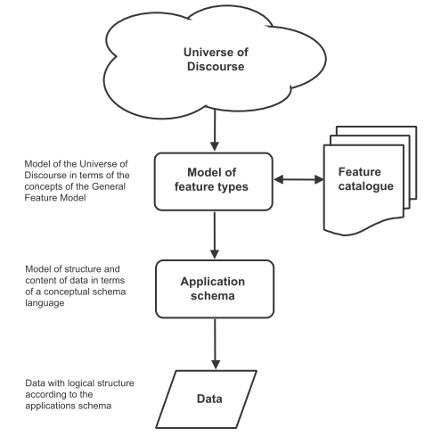
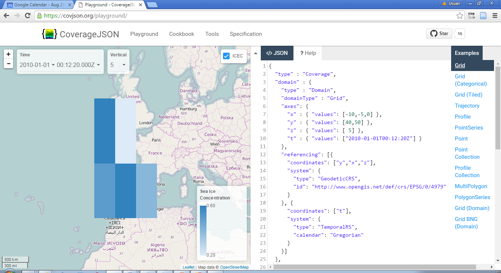

== The geometrical dimension in JSON

//-------Remove after TC approval-------

Readers should consider the following warning.

WARNING: This document defines a draft OGC Best Practice on a particular technology or approach. This document is not an OGC Standard and may not be referred to as an OGC Standard. This document is not an official position of the OGC.

//----------------------------------------

One of the main purposes of OGC is providing ways to represent the geospatial dimension of data and in particular a representation for geometries. In the past, OGC has done this in several ways, some of the most recognized ones are:

* GML (Geographic Markup Language): a XML encoding for geospatial features exchange that mainly focus on providing geospatial primitives encoded in XML. Other XML encodings use it as a basis, such as CityGML, WaterML, O&M, IndoorML, etc.
* KML: a XML encoding for vector features, mainly focused on presentation in a virtual globe.
* WKT (Well Known Text): a textual encoding for vector features, to be used in geospatial SQL or SparQL queries and in OpenSearch Geo.
* GeoRSS: a XML encoding for inserting geospatial geometries in RSS and atom feeds.
* GeoSMS: a compact textual encoding for positions in SMS messages.

For the moment, there is no agreement for JSON encoding for geospatial features in OGC. This section discusses several alternatives.

=== Modeling features and geometries
The ISO 19109 _General Feature Model_ discusses aspects of defining  features. The ISO 19109 is generally accepted by the OGC community that includes many of its concepts in the http://portal.opengeospatial.org/files/?artifact_id=29536[OGC 08-126 _The OpenGIS® Abstract Specification Topic 5: Features_].

Next figure describes the most abstract level of defining and structuring geographic data. In the context of a geographic application, the real world phenomena are classified into feature types that share a common list of attribute types. This means that if, for example, the geographical application is capturing protected areas, a _protected area_ feature type will define the attributes to capture them and all protected areas will share the same data structure.

[[The_process_from_universe_of_discourse_to_data]]
.The process from universe of discourse to data

In practice, and following the same example, this means that there will be a _feature catalogue_ where an abstract _protected area_ is defined as having a multi-polygon, a list of ecosystem types, a list of ecosystem services, a elevation range, a year of definition, the figure of protection used, etc.

[[From_reality_to_geographic_data_image]]
.From reality to geographic data

This feature type will be formalized in an application schema. Here, we present a table as a formal way to define the attributes of the protected areas _feature type_.

.Protected area feature type attributes
[width="100%",options="header"]
|====================
| Attribute | Type | Multiplicity
| Official border | Multi-polygon | one
| Influence area | Multi-polygon | one
| Name | String | one or more
| Ecosystem type | String | one or more
| Ecosystem service | String | one or more
| Elevation range | Float | two
| Year of definition | Integer | zero or one
| Figure of protection | String | zero or one
|====================

This way of defining features as following feature types is basic for the OGC community. GML have included the concept of the application schema from its earlier versions (i.e. an XML Schema). Nevertheless, there are formats that does not follow explicitly the same approach. For example, GeoRSS uses a fixed structure for attributes (common for all features; whatever the feature type) and adds a geometry. KML did not included the capacity to group features in features types until version 2.2 (the first OGC adopted community standard), and this version 2 is the first one to allow more that one property per feature. It includes a <Schema> tag to define feature types and its property names in a section of the document. Later, the feature type names can be used in PlaceMarks as part of the "ExtentedData/SchemaData" tag.

In the next subsections we will see how JSON can be used in different ways, some of them being compliant to the ISO General Feature Model.

=== GeoJSON
After years of discussion, in August 2016 the IETF RFC7946 was released, describing the GeoJSON format. GeoJSON is self-defined as "a geospatial data interchange format based on JSON. It defines several types of JSON objects and the manner in which they are combined to represent data about geographic features, their properties, and their spatial extents."

It defines the following object types "Feature", "FeatureCollection, "Point", "MultiPoint", "LineString", "MultiLineString", "Polygon", "MultiPolygon", and "GeometryCollection".

GeoJSON presents some contradictions about complex data types: JSON has no object type concept but GeoJSON includes a "type" property in each object it defines, to declare the type of the object. In contrast, GeoJSON does not include the concept of _feature type_, in the GFM sense, as will be discussed later.

GeoJSON presents a feature collection of individual features. Each Feature has, at least 3 "attributes": a fixed value "type" ("type":"Feature"), a "geometry" and a "properties". Geometry only have 2 "attributes": "type" and "coordinates":

* "type" can be: "Point", "MultiPoint", "LineString", "MultiLineString", "Polygon", "MultiPolygon", and   "GeometryCollection".
* "coordinates" is based in the idea of position. A position is an array of 2 [long, lat] or 3 numbers [long, lat, h]. The data type of "coordinates" depends on the type of "geometry":

** in Point, "coordinates" is a single position
** in a LineString or MultiPoint, "coordinates"  is an array of positions
** in a Polygon or MultiLineString, "coordinates" is an array of LineString or linear ring
** in a MultiPolygon, "coordinates" is an array of Polygon

There is no specification on what "properties" can contain so implementors are free to provide feature description composed by several attributes in it.

.Example of GeoJSON file describing a protected area (coordinates are dummy)
[source,json]
----
{
    "type": "FeatureCollection",
    "features": [{
        "type": "Feature",
        "geometry": {
            "type": "MultiPolygon",
            "coordinates": [
              [[[102.0, 2.0], [103.0, 2.0], [103.0, 3.0], [102.0, 3.0], [102.0, 2.0]]],
              [[[100.0, 0.0], [101.0, 0.0], [101.0, 1.0], [100.0, 1.0], [100.0, 0.0]],
               [[100.2, 0.2], [100.8, 0.2], [100.8, 0.8], [100.2, 0.8], [100.2, 0.2]]]
              ]
        },
        "id": "http://www.ecopotential.org/sierranevada",
        "bbox": [100.0, 0.0, 103.0, 3.0],
        "properties": {
            "name": "Sierra Nevada",
            "ecosystemType": "Mountain",
            "ecosystemService": ["turism", "biodiversity reserve"],
            "elevationRange": [860, 3482],
            "figureOfProtection": "National park"
        }
    }]
}
----

==== GeoJSON particularities

A list of considerations extracted from the RFC 7946 require our attention:

* Features can have ids: "If a Feature has a commonly used identifier, that identifier SHOULD be included as a member of the Feature object with the name _id_"
* Features can have a "bbox": "a member named _bbox_ to include information on the coordinate range. The value of the bbox member MUST be an array of numbers, with all axes of the most southwesterly point followed by all axes of the more northeasterly point."
* Coordinates are in CRS84 + optional _ellipsoidal_ height. "The coordinate reference system for all GeoJSON coordinates is a geographic coordinate reference system, using the World Geodetic System 1984 (WGS 84) [WGS84] datum, with longitude and latitude units of decimal degrees. This is equivalent to the coordinate reference system identified by the Open Geospatial Consortium (OGC) URN urn:ogc:def:crs:OGC::CRS84. An OPTIONAL third-position element SHALL be the height in meters above or below the WGS 84 reference _ellipsoid_."
* "Members not described in RFC 7946 ("foreign members") MAY be used in a GeoJSON document."
* GeoJSON elements cannot be recycled in other places: "GeoJSON semantics do not apply to foreign members and their descendants, regardless of their names and values."
* The GeoJSON types cannot be extended: "Implementations MUST NOT extend the fixed set of GeoJSON types: FeatureCollection, Feature, Point, LineString, MultiPoint, Polygon, MultiLineString, MultiPolygon, and GeometryCollection."
* "The media type for GeoJSON text is _application/geo+json_"

GeoJSON honors the simplicity of the JSON and JavaScript origins. GeoJSON defines _Feature collections_ and _Features_ but does not contemplate the possibility of defining Feature types or associating a Feature to a feature type. In our opinion this is consistent with JSON itself, that does not include the _data type_ concept, but diverges from the General Feature Model (GFM). In practice, this means that the number and type of the properties of each feature can be different. With this level of flexibility, GeoJSON is not the right format for exchanging data between repositories based on the GFM. In the introduction, RFC7946 compares GeoJSON with WFS outputs. This comparison is an oversimplification; even if the response of a WFS return a feature collection, RFC7946 overlooks that WFS deeply uses the _Feature Type_ concept that is missing in GeoJSON.

Note that the coordinate order is longitude latitude. This is not the common practice in OGC but is unambiguously defined so it is conformance to the OGC axis order policy. It also requires an ellipsoid (instead of an sphere used in OSM) that provides more precision. What is more surprise is the decision of using _ellipsoidal_ height. This decision is against common practice and it is difficult to compensate. Most of the elevations are defined and distributed as _orthometric_ and to transform an _ellipsoidal_ height into a _orthometric_ elevantion will require a precise ellipsoid.

==== Geospatial communityy needs that GeoJSON does not cover
In GeoJSON:

* There is no feature model. Sometimes there is the question about GeoJSON covering the OGC GML Simple Features. This is not the case: GML Simple Features uses the GFM in a simplified way but GeoJSON ignores the GFM.
* There is no support for CRSs other than CRS84.
* The geometries cannot be extended to other types.
* There is no support for the time component or anyother extra dimensions
*  _orthometric_ elevations can only be provided as (non-geometric) properties
* There is no information on symbology.

In practice, this means that GeoJSON can only be used in similar circumstances where KML can be used (but without symbology). GeoJSON cannot be used in the following use cases:

* When there is a need to communicate features that are based on the GFM and that depend on the feature type concept.
* When there is a need to communicate features that need to be transported in other CRS that CRS84, such as the combination of UTM/ETRS89.
* When the time component or other dimensions need to be considered as a coordinate.
* When simple geometries are not enough and there is a need for circles, arcs of circle, 3D meshes, etc.
* When coverage based (e.g. imagery) or O&M based (e.g. WaterML) data need to be communicated.
* When there is a need to use JSON-LD and to connect to the _linked data_ (arrays of arrays are not supported in JSON-LD)

In these cases there are three possible options:

* Simplify our use case until it fits in the GeoJSON requirements (see <<Simplify_our_use_case>>)
* Extend GeoJSON. In the "feature" or in the "properties" element of each FeatureCollection, include everything not supported by the GeoJSON (see <<Extend_GeoJSON>>)
* Deviate completely from the GeoJSON and use another JSON model for geometries (see <<Another_JSON_model_for_geometries>>)

Lets explore these possibilities on one by one. There is still another possibility: Violated the GeoJSON standard by relaxing some of their rules that prevent extensions. we do not consider this possibility a good alternative and it will not be discussed.

[[Simplify_our_use_case]]
==== Simplify our use case until it fits in the GeoJSON requirements

In our opinion, GeoJSON is not an exchange format (contradicting what it is said in the RFC7946) but a visualization format ideal for representing data in web browsers. In that sense, the comparison in RFC7946 introduction with KML is appropriate. As said before, JSON lacks any visualization/portrayal instructions so symbolization will be applied in the client site or will be transmitted in an independent format.

In the cases where GeoJSON is a possible output of our information (complemented by other data formats as alternatives), there is no problem on adapting our data model to the GeoJSON requirements (even if we are going to lose some characteristics), because we also offer other alternatives that are loseless. In these scenarios, we will not recommend the GeoJSON format as a exchange format but as a visualization format. In OGC services, a WMS could server maps in GeoJSON and WFS can consider GeoJSON as one of the advertised and provided formats.

This is the way we can simplify our requirements to adapt them to JSON:

* Even if features are of the same feature type and share a common structure, we forget about this when transforming to GeoJSON.
* If there is more than one geometric property in the features, select one geometric property for the geometries and remove the rest.
* Move all other feature properties inside the "properties" attribute. This will include, time, feature metadata, symbolization attributes, etc.
* Convert your positions to CRS84.
* If we have elevation information, Convert it to _ellipsoidal_ height.
* Convert any geometry that can not be directly represented in GeoJSON (e.g a circle) to a sequence of vertices and lines.

[[Extend_GeoJSON]]
==== Extend GeoJSON
The GeoJSON extensibility is limited by the interpretation of the sentence in the IETF standard "Implementations MUST NOT extend the fixed set of GeoJSON types: FeatureCollection, Feature, Point, LineString,  MultiPoint, Polygon, MultiLineString, MultiPolygon, and GeometryCollection.". The sentence is a bit ambiguous but, in general, you are allowed to include any content in the "properties" section, and there is no clear objection on adding attributes to "feature" (even most GeoJSON parsers will ignore them). It seems that you are neither allowed to invent new geometries nor to modify the current existing ones. With this limitations in mind, be can do several things, including the ones covered in the following subsections.

===== Adding visualization to GeoJSON
For some people, visualization is an important aspect that should be in GeoJSON and they have provided some approaches for including visualization styles.

* An style extension from MapBox includes terms in "properties" of the "Feature"s.
https://github.com/mapbox/simplestyle-spec/tree/master/1.1.0

.Mapbox simplestyle-spec to add some styles to GeoJSON
[source,json]
----
{
    "type": "FeatureCollection",
    "features": [{ "type": "Feature",
        "geometry": {
            "type": "Polygon",
            //...
        },
        "properties": {
            "stroke": "#555555",
            "stroke-opacity": 1.0,
            "stroke-width": 2,
            "fill": "#555555",
            "fill-opacity": 0.5
        }
    }]
}
----

* Leaflet.geojsonCSS is an extension for Leaflet to support rendering GeoJSON with css styles in a "style" object in "Feature".
https://github.com/albburtsev/Leaflet.geojsonCSS

.Leaflet.geojsonCSS to add some styles to GeoJSON
[source,json]
----
{
    "type": "FeatureCollection",
    "features": [{ "type": "Feature",
        "geometry": {
            "type": "Polygon",
        },
        "style": {
            "color": "#CC0000",
            "weight": 2,
            "fill-opacity": 0.6,
            "opacity": 1,
            "dashArray": "3, 5"
        },
        "properties": {
            //...
        }
    }]
}
----

[[Other_CRS_representation_geometry]]
===== Other CRS representation for the same geometry
Sometimes it could be necessary to distribute your data in other CRSs that are not CRS84. As long as you are not doing this in the "geometry" part of the GeoJSON, you are allowed to do this. You can even reuse the _geometry_ object in the _properties_ section, knowing that they will be not considered by pure GeoJSON parsers.

.Example of GeoJSON file describing a protected area also in EPSG:25831 (coordinates are dummy).
[source,json]
----
{
    "type": "FeatureCollection",
    "features": [{
        "type": "Feature",
        "geometry": {
            "type": "MultiPolygon",
            "coordinates": [
              [[[102.0, 2.0], [103.0, 2.0], [103.0, 3.0], [102.0, 3.0], [102.0, 2.0]]],
              [[[100.0, 0.0], [101.0, 0.0], [101.0, 1.0], [100.0, 1.0], [100.0, 0.0]],
               [[100.2, 0.2], [100.8, 0.2], [100.8, 0.8], [100.2, 0.8], [100.2, 0.2]]]
              ]
        },
        "id": "http://www.ecopotential.org/sierranevada",
        "bbox": [100.0, 0.0, 103.0, 3.0],
        "bboxCRS": {
            "bbox": [500100.0, 4600000.0, 500103.0, 4600003.0],
            "crs": "http://www.opengis.net/def/crs/EPSG/0/25831",
        }
        "properties": {
            "geometryCRS": {
                "type": "MultiPolygon",
                "crs": "http://www.opengis.net/def/crs/EPSG/0/25831",
                "coordinates": [
                  [[[500102.0, 4600002.0], [500103.0, 4600002.0], [500103.0, 4600003.0], [500102.0, 4600003.0], [500102.0, 4600002.0]]],
                  [[[500100.0, 4600000.0], [500101.0, 4600000.0], [500101.0, 4600001.0], [500100.0, 4600001.0], [500000.0, 4600000.0]],
                   [[500100.2, 4600000.2], [500100.8, 4600000.2], [500100.8, 4600000.8], [500100.2, 4600000.8], [500100.2, 4600000.2]]]
                  ]
            },
            "name": "Sierra Nevada",
            "ecosystemType": "Mountain",
            "ecosystemService": ["turism", "biodiversity reserve"],
            "elevationRange": [860, 3482],
            "figureOfProtection": "National park"
        }
    }]
}
----

[[Another_JSON_model_for_geometries]]
==== Another JSON model for geometries
The last alternative is to completely forget about GeoJSON and define your own encoding strictly following the GFM.

.Example of JSON file describing a protected area without using GeoJSON (coordinates are dummy).
[source,json]
----
{
    "id": "http://www.ecopotential.org/sierranevada",
    "featureType": "ProtectedArea",
    "officialBorder": {
        "type": "MultiPolygon",
        "crs": "http://www:opengis.net/def/crs/OGC/1/3/CRS84",
        "coordinates": "[
          [[[102.0, 2.0], [103.0, 2.0], [103.0, 3.0], [102.0, 3.0], [102.0, 2.0]]],
          [[[100.0, 0.0], [101.0, 0.0], [101.0, 1.0], [100.0, 1.0], [100.0, 0.0]],
           [[100.2, 0.2], [100.8, 0.2], [100.8, 0.8], [100.2, 0.8], [100.2, 0.2]]]
          ]"
    }
    "infuenceArea": {
        "type": "MultiPolygon",
        "crs": "http://www:opengis.net/def/crs/OGC/1/3/CRS84",
        "coordinates": "[
          [[[99.0, 1.0], [113.0, 1.0], [113.0, 5.0], [99.0, 5.0], [99.0, 1.0]]],
          [[[80.0, -10.0], [110.0, -10.0], [110.0, 11.0], [80.0, 11.0], [90.0, -10.0]],
           [[90.2, -0.2], [108.8, -0.2], [108.8, 1.8], [108.2, 1.8], [90.2, -0.2]]]
          ]"
    }
    "name": "Sierra Nevada",
    "ecosystemType": "Mountain",
    "ecosystemService": ["turism", "biodiversity reserve"],
    "elevationRange": [860, 3482],
    "figureOfProtection": "National park"
}
----

The previous example has been defined in a way that is compatible with JSON-LD and can be automatically converted to RDF if a @context is provided. Please, note that coordinates are expressed as strings to force a JSON-LD engine to do not process them as arrays but consider them strings that will not be manipulated. This notation has been suggested in OGC 16-051 JavaScript JSON JSON-LD ER. We call it JSON double encoding as the string is written in a notation that is a serialization of JSON and the content of "coordinates" can be parsed by a JSON.parse() sentence into a JSON object and converted into a multidimensonal array easily if needed.

===== JSON for coverages
Since the first version of the HTML and graphical web browsers, it was possible by the graphical interface to show a JPEG or a PNG. With addition of HTML DIV tags, it was possible to overlay PNGs in a layer stack and show them together (provided that the top PNG uses transparency of alpha channel to make the lower levels visible, at least partially). WMS took advantage of this characteristic to create interoperable map browsers on the web. The main problem with this approach was that the "map" could not be manipulated in the client, so symbolization of the map had to be applied in the server side, resulting in limited and slows  interaction with the data. Modern web browsers implementing HTML5 allow for controlling pixel values on the screen representation in what is called _canvas_. This capability allows sending an array of values from a coverage server to web browser that can be converted into a RGBA array and then represented in a canvas. This represents an evolution of what was possible in the past. By implementing this strategy it is possible to control the coloring of "maps" directly in the browser and to make queries on the actual image values directly in the client. What was an static map becomes a dynamic coverage.

A good coverage needs to be described through a small set of metadata that defines the domain (the grid), the range values (the data) and the range meaning (the data semantics). This is exactly what the Coverage Implementation Schema (CIS) does (formerly known as GMLCov).

The idea of creating a JSON GMLCov associated to a JSON coverage appears for the first time in the section 9 of the OGC 15-053r1 Testbed-11 Implementing JSON/GeoJSON in an OGC Standard Engineering Report. This idea was later imported by the MELODIES FP7 project (http://www.melodiesproject.eu/), and described as a full specification, as well as implemented as an extension of the popular map browser _Leaflet_. The description of the approach can be found here https://github.com/covjson/specification. A complete demostration on how it works can be found here: https://covjson.org/playground/ (tested with Chrome).

[[Coverages_JSON_Playground]]
.CoveragesJSON playground dummy example for continuous values in http://covjson.org

CoverageJSON is a demonstration of what can be done with coverages in the browsers. On our opinion, this approach will improve the user experience working with imagery and other types of coverages in web browsers. Unfortunately, the CoverageJSON defined by MELODIES deviates significantly from the OGC CIS. Actually CoverageJSON redesigns CIS to replicate most of the concepts in a different way and adds some interesting new concepts and functionalities of its own.

To offer a JSON encoding completelly aligned with the OGC coverage representation, a JSON encoding is introduced in the OGC CIS 1.1. In this case, the JSON encoding strictly follows the CIS 1.1 UML model. This encoding is presented in section 13 on CIS 1.1 and includes a set of JSON schemas. In addition, section 14 adds requirements for JSON-LD that are complemented by JSON-LD context files. Several examples are also informative material accompanying the CIS 1.1 document. More details can be found also in this ER: OGC 16-051 JavaScript JSON JSON-LD ER.

.Example of a regular grid represented as a CIS JSON file
[source,json]
----
{
	"@context": ["http://localhost/json-ld/coverage-context.json", {"examples": "http://www.opengis.net/cis/1.1/examples/"}],
	"type": "CoverageByDomainAndRangeType",
	"id": "examples:CIS_10_2D",
	"domainSet":{
		"@context": "http://localhost/json-ld/domainset-context.json",
		"type": "DomainSetType",
		"id": "examples:CIS_DS_10_2D",
		"generalGrid":{
			"type": "GeneralGridCoverageType",
			"id": "examples:CIS_DS_GG_10_2D",
			"srsName": "http://www.opengis.net/def/crs/EPSG/0/4326",
			"axisLabels": ["Lat", "Long"],
			"axis": [{
				"type": "RegularAxisType",
				"id": "examples:CIS_DS_GG_LAT_10_2D",
				"axisLabel": "Lat",
				"lowerBound": -80,
				"upperBound": -70,
				"uomLabel": "deg",
				"resolution": 5
			},{
				"type": "RegularAxisType",
				"id": "examples:CIS_DS_GG_LONG_10_2D",
				"axisLabel": "Long",
				"lowerBound": 0,
				"upperBound": 10,
				"uomLabel": "deg",
				"resolution": 5
			}],
			"gridLimits": {
				"type": "GridLimitsType",
				"id": "examples:CIS_DS_GG_GL_10_2D",
				"srsName": "http://www.opengis.net/def/crs/OGC/0/Index2D",
				"axisLabels": ["i", "j"],
				"axis": [{
					"type": "IndexAxisType",
					"id": "examples:CIS_DS_GG_GL_I_10_2D",
					"axisLabel": "i",
					"lowerBound": 0,
					"upperBound": 2
				},{
					"type": "IndexAxisType",
					"id": "examples:CIS_DS_GG_GL_J_10_2D",
					"axisLabel": "j",
					"lowerBound": 0,
					"upperBound": 2
				}]
			}
		}
	},
	"rangeSet": {
		"@context": "http://localhost/json-ld/rangeset-context.json",
		"type": "RangeSetType",
		"id": "examples:CIS_RS_10_2D",
		"dataBlock": {
			"id": "examples:CIS_RS_DB_10_2D",
			"type": "VDataBlockType",
			"values": [1,2,3,4,5,6,7,8,9]
		}
	},
	"rangeType": {
		"@context": "http://localhost/json-ld/rangetype-context.json",
		"type": "DataRecordType",
		"id": "examples:CIS_RT_10_2D",
		"field":[{
			"type": "QuantityType",
			"id": "examples:CIS_RT_F_10_2D",
			"definition": "ogcType:unsignedInt",
			"uom": {
				"type": "UnitReference",
				"id": "examples:CIS_RT_F_UOM_10_2D",
				"code": "10^0"
			}
		}]
	}
}
----
